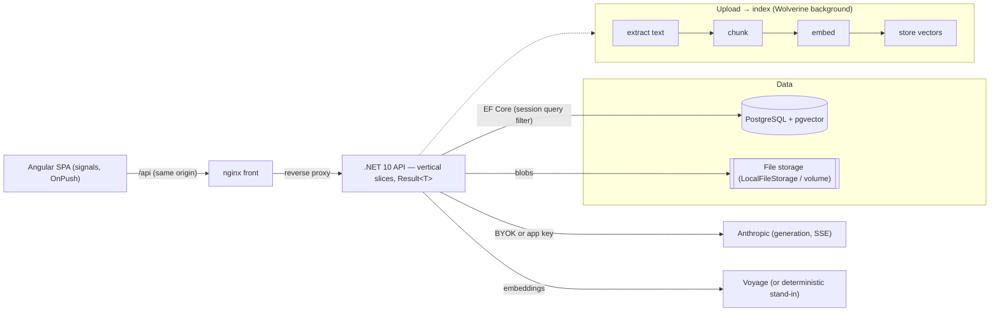

# RagBook

**A RAG assistant over your own documents.** Upload PDF / TXT / Markdown → the text is chunked and embedded into
**pgvector** → ask natural-language questions → get **streamed answers with clickable citations**, grounded strictly
in your documents (it refuses when the answer isn't there). A **.NET 10** modular monolith (vertical slices,
`Result<T>` → RFC 9457 ProblemDetails, Wolverine) paired with an **Angular 20** SPA, backed by **PostgreSQL +
pgvector**, packaged for **one-command local run** and **GCP Cloud Run**.

Built end-to-end across **20 user stories** via a spec-driven workflow (constitution → spec → plan → tasks →
implement, all under `.specify/` and `docs/features/`), each shipped behind four green test tiers (Domain,
Application, Testcontainers integration, Angular) + CI.

## Try it in a minute

Open the app, pick the **"Dokumenty demo"** scope (no API key needed), click one of the suggested questions → a
streamed answer with clickable citations appears — on built-in, read-only demo documents paid for by a server key.

> _Demo GIF: upload → question → citation — capture and embed here (`docs/media/demo.gif`)._

## Architecture



**Isolation**: every visitor gets an anonymous `UserSessionId` (cookie); a global EF query filter scopes every read
to the session — cross-session data is invisible (404), enforced architecturally, not by hand.

## Design decisions (each with the rejected alternative)

- **Folder hierarchy → materialized path**, not a recursive CTE. Each folder stores `Path = /{id}/{id}/…/`; a subtree
  query is a single `LIKE '/{id}/%'` (indexable), and a move is one prefix-rewrite in a transaction. _Rejected:_ a
  recursive CTE over `parent_id` — simpler to write but an unbounded recursive read per tree/query and awkward to
  index; the fixed max depth (3) makes the path cheap.
- **Retrieval → pre-filter in the same pgvector query**, not separate per-scope indexes. One SQL statement filters by
  `user_session_id` + ready status + scope (`all` / folder path prefix / document / demo-origin) **then** runs the
  cosine search, so isolation and scope are enforced inside the vector search. _Rejected:_ maintaining a separate
  vector index per folder/scope — more indexes to keep in sync, and it can't express "the session's documents".
- **BYOK without secret persistence.** A user's Anthropic key lives only in a per-session in-memory cache and is sent
  as a request header; it is **never** written to the database or logs. _Rejected:_ storing the key (even encrypted)
  at rest — a standing liability for a throwaway session key; the trade-off is that keys don't survive a restart
  (acceptable, documented).
- **Grounding = similarity threshold + a refusal sentinel.** Only passages above a cosine threshold are sent; the
  prompt instructs the model to answer **only** from them and to emit an exact refusal phrase when unsupported,
  which the server maps to a neutral "not found in your documents" state. _Rejected:_ trusting the model to
  self-limit without a threshold or sentinel — hallucination risk and no deterministic "no answer" signal.
- **One embedding model for the whole index.** Every chunk and every query uses the same model/dimension
  (`voyage-3.5`, 1024) — vectors are only comparable within one model. _Rejected:_ mixing models / re-embedding
  per query — incomparable vectors and index churn.
- **Bulk operations are all-or-nothing.** A bulk move/delete validates **every** id first, then applies in one
  transaction; any invalid item refuses the whole operation with a per-id `failures[]` (422) and changes nothing.
  _Rejected:_ per-item best-effort with partial success — a half-applied bulk delete is worse than none.

## RAG pipeline, step by step

1. **Upload** (PDF/TXT/MD) → validated (type from content, size, quota) → stored as a blob + a `documents` row.
2. **Extract** text (background, Wolverine) → **chunk** (structural) → **embed** each chunk (Voyage, or a
   deterministic stand-in when no key) → **store** vectors in pgvector (HNSW cosine index); the document goes `Ready`.
3. **Ask**: the question is validated, the **scope** resolved, and the question embedded.
4. **Retrieve**: one pre-filtered pgvector cosine search (session + ready + scope) returns the top-K passages.
5. **Threshold**: passages below the similarity cutoff are dropped; if none survive → a deterministic "no grounds"
   answer (the model is not called).
6. **Ground + generate**: the surviving passages + the grounding prompt stream to Anthropic; tokens stream to the
   browser over SSE with numbered **citations** that resolve to the source passages.
7. **Refuse when unsupported**: a refusal sentinel maps to a neutral no-answer state; conversation history persists.

## Error handling

Every failure is a `Result<T>` → RFC 9457 ProblemDetails with a stable `module.snake_case` `code` + an `X-Trace-Id`
correlation id (also on the logs); unhandled exceptions become a sanitized 500 with no stack trace. The frontend maps
every code through one dictionary. Full catalog: **[docs/features/README.md → Katalog kodów błędów](docs/features/README.md)**.

## Run locally (one command)

```sh
cp .env.example .env          # optionally add Anthropic__ApplicationKey + Embedding__ApiKey
docker compose up --build     # postgres(pgvector) → migrate → api → web(nginx)
# open http://localhost:8080
```

`migrate` applies EF migrations (incl. `CREATE EXTENSION vector`) as a **separate step** — never at app startup
(constitution §VIII); the API then seeds the demo documents idempotently. With no keys the app is fully browsable and
demo mode shows a readable "temporarily unavailable" message.

## Deploy to the cloud

GCP Cloud Run + Cloud SQL (pgvector) + Secret Manager — see **[deploy/README.md](deploy/README.md)** and
`deploy/cloudbuild.yaml`. Secrets come **only** from Secret Manager; SSE works within the request timeout via the
app's keep-alive; `min-instances=0` means a few-second cold start on first hit.

## Known limitations / future work

- **File storage**: `LocalFileStorage` on a volume; a **GCS `IFileStorage` adapter** is the productionization step for
  durable, multi-instance uploads (not yet built).
- **Cold start**: scale-to-zero trades a few seconds on the first request for cost.
- **BYOK keys are per-instance** (in-memory) — not shared across multiple Cloud Run instances.
- **No monitoring/alerting or IaC (Terraform)** yet; a custom domain is optional.

## Development (Aspire)

```sh
cd src/Web && npm install && cd -             # install SPA deps once
dotnet run --project src/RagBook.AppHost      # Aspire: PostgreSQL + API + Angular dev server (Docker required)
```

## Solution layout

| Project | Responsibility |
|---|---|
| `src/RagBook` | Core: domain + application. `Modules/<Module>/` → `Domain/` + `Features/`; per-module `Errors/`. |
| `src/RagBook.API` | Transport: endpoints, session middleware, DI composition, ProblemDetails mapping. |
| `src/RagBook.Infrastructure` | EF Core persistence, session context, interceptors (`SharedContext/`). |
| `src/RagBook.Infrastructure.Migrations` | EF Core migrations only. |
| `src/RagBook.AppHost` | .NET Aspire orchestration (PostgreSQL + API + Angular dev server). |
| `src/RagBook.ServiceDefaults` | Shared telemetry/health/resilience (`AddServiceDefaults()`). |
| `src/Web` | Angular SPA (standalone, signals, OnPush). |
| `tests/*` | Domain / Application / Api.IntegrationTests (Testcontainers). |

## Build & test

```sh
dotnet build RagBook.slnx
dotnet test  tests/RagBook.Domain.Tests         # pure domain, no Docker
dotnet test  tests/RagBook.Application.Tests     # handlers/validators, no Docker
dotnet test  tests/RagBook.Api.IntegrationTests  # Testcontainers PostgreSQL — START DOCKER FIRST
cd src/Web && npm test                           # Angular (Karma + ChromeHeadless)
```

---

# Feature deep-dives

The sections below document each capability in depth (the story map is in `docs/features/`).

## Izolacja danych (data isolation)

RagBook has **no login** in the MVP. Every visitor gets an anonymous **`UserSessionId` (GUID v4)** on
their first request, carried in a cookie that is **`HttpOnly`, `Secure`, `SameSite=Strict`** with a
**30-day sliding expiry** (refreshed on every visit). All cookie tunables are configuration-driven
(`Session:*` — no magic numbers). A missing, expired, or forged cookie is treated as a fresh empty
session, never an error.

Isolation is **enforced architecturally, not by hand in handlers**:

- Every session-owned entity implements **`ISessionOwned`** (a non-nullable `UserSessionId`, indexed).
- `RagBookDbContext` applies a **global query filter** to *every* `ISessionOwned` entity type:
  `e => e.UserSessionId == sessionContext.UserSessionId`, keyed to the injected `ISessionContext`
  (resolved once per request by `SessionMiddleware`). A handler that forgets to filter **still**
  cannot read another session's rows.
- `SessionStampingInterceptor` stamps `UserSessionId` on insert centrally, so handlers never set it.
- Because a cross-session read returns nothing, requesting another session's resource by id resolves
  to **404 Not Found — never 403** — so resource existence is never disclosed.

This is verified by the `tests/RagBook.Api.IntegrationTests` suite (Testcontainers PostgreSQL) for
AC-1..AC-4, and by an offline model test asserting the query filter is present on every
`ISessionOwned` entity.

## Limit plików (file quota)

Each session gets a **free-tier file quota**, enforced **server-side before any write** (US-05):

| Limit | Default | Config key |
|---|---|---|
| Documents per session | **10** | `Quota:MaxDocuments` |
| Single file size | **10 MB** | `Quota:MaxFileSizeMb` |
| Total storage per session | **50 MB** | `Quota:MaxTotalMb` |

Every limit is **config-driven — no magic numbers**. The defaults model the free tier; **"quota-ready"**
means raising a tier is a **configuration edit only** (`QuotaOptions` bound from the `Quota` section),
no code change. MB are decimal (1 MB = 1,000,000 bytes).

- The **`Documents` module** owns the quota slice: `IQuotaService` decides admission against the pure
  `QuotaSnapshot`, reading the session's usage through the `IDocumentQuotaRepository` seam. `GET /api/quota`
  returns the current state (used/limits, `canUpload`) for the UI counter.
- **Failed** documents count toward the quota; **demo** documents (`DocumentOrigin.Demo`, US-03) do not —
  a forward-looking seam, not built here. The real upload (US-04) admits files through the same
  `TryAdmitAsync` seam.
- Breaches return a stable `quota.*` code (`quota.exceeded`, `quota.total_size_exceeded`,
  `quota.file_too_large`) through the `Result<T>` → RFC 9457 ProblemDetails channel — never a naked 500.
- **Concurrency (AC-5):** the quota-check-and-insert is **atomic** — a **transaction-scoped PostgreSQL
  advisory lock** (`pg_advisory_xact_lock`) keyed by session id serializes admissions, and usage is
  re-read *under the lock*. Two concurrent uploads at 9/10 admit **at most one** — proven by a
  Testcontainers PostgreSQL integration test.
- **Frontend:** a signals-based `QuotaStore` backs the `app-quota-bar` component ("X / 10 plików",
  "X / 50 MB"); it refreshes from `GET /api/quota` after any upload or deletion so the counter updates
  without a page reload.

## Hierarchia folderów (materialized path)

Folders organise a session's documents into a tree the visitor can **create, rename, and delete**,
nested up to **3 levels** (US-09). The hierarchy uses a **materialized path whose segments are folder
ids**, not names:

| Folder | `path` |
|---|---|
| `Umowy` (root, id `A`) | `/A/` |
| `2026` (child, id `B`) | `/A/B/` |
| `Q1` (grandchild, id `C`) | `/A/B/C/` |

- **Subtree = prefix match, no recursive CTEs.** A folder's descendants are `WHERE path LIKE parent.path
  || '%'`, backed by a `text_pattern_ops` index on `path`. Depth is the **segment count**, so the
  3-level limit is a segment check on the parent (`FolderErrors.MaxDepthExceeded`).
- **Rename is O(1).** Because segments are ids (not names), changing a folder's name never rewrites any
  path — descendants are untouched.
- **Names are unique per parent, case-insensitively.** Enforced by **two partial unique indexes** on
  `(user_session_id, [parent_id,] LOWER(name))` — one `WHERE parent_id IS NULL` (root), one `WHERE
  parent_id IS NOT NULL` (nested), because Postgres treats `NULL` parent_ids as distinct. A race is
  caught by the constraint and mapped to `folder.duplicate_name`; names are trimmed before validation.
- **Only empty folders delete.** A self-referencing `parent_id` FK with `ON DELETE RESTRICT` refuses to
  drop a folder that still has children; the "contains files" arm is the forward-looking
  `IFolderFileProbe` seam — **US-04 replaced its no-op with a real `documents.folder_id` query**, so a
  folder holding files can no longer be deleted. Non-empty → `folder.not_empty`.
- Every limit is **config-driven** (`Folders:MaxDepth` = 3, `Folders:MaxNameLength` = 100); breaches
  return stable `folder.*` codes through the `Result<T>` → ProblemDetails channel. **Frontend:** a
  signals `FolderTreeStore` backs the `app-folder-tree` component (create/rename/delete context actions;
  "New folder" is hidden at max depth).

## Upload dokumentu (US-04)

Visitors upload **PDF/TXT/Markdown** files into a folder (or the root) via `POST /api/documents`
(multipart). Validation is **by content, not extension**:

- A PDF is identified by its `%PDF-` signature; any other upload must be **valid UTF-8 text** (rejecting
  binaries renamed `.txt`) and is classified `.md` → `text/markdown`, else `text/plain`. Mismatches →
  `document.unsupported_file_type`; 0-byte → `document.empty_file`.
- The order is **empty → type → size → folder → store → atomic quota admit**. Size, count, and total
  limits are the **US-05 quota** (`Quota:*`, config-driven); the count/total admit reuses the US-05
  **advisory lock**, so a folder-target upload and the quota stay atomic under concurrency.
- Binaries live **outside Postgres** behind **`IFileStorage`** (a local volume in dev via
  `FileStorage:RootPath`; cloud object storage in prod). **Store-then-record with cleanup**: the row is
  written only after the blob is stored; a failed admit/insert deletes the blob (no orphans).
- A duplicate name in a folder is **auto-suffixed** `name (n).ext` (n from 1), computed under the
  session lock and backed by two partial unique indexes on `(folder_id, LOWER(file_name))` — never
  blocking, never overwriting, race-safe.
- On success the document is recorded `Processing` and a **`DocumentUploaded`** event is published for
  background processing (US-06). **Frontend:** a signals `DocumentUploadStore` + `app-document-upload`
  (button + drag-and-drop + progress + client pre-validation) refreshes the tree and quota without a reload.

## Drzewo dokumentów (US-07)

The main view is one **folders + documents tree**, built with **`@angular/cdk` `cdk-tree`**:

- **One request, no N+1.** `GET /api/tree` returns the session's folders and documents in a single
  response — the Infrastructure `TreeReader` runs exactly two session-scoped queries (folders `ORDER BY
  LOWER(name)`, documents `ORDER BY uploaded_at DESC`) behind the Tree module's single `ITreeReader`
  seam, so the Tree slice references neither the Folders nor the Documents module.
- **Client composition.** A signals `TreeStore` composes the nested tree from the two flat lists
  (folders A→Z, documents newest-first; root documents at the top). Folder create/rename/delete reuse
  `FolderTreeStore` and then call `TreeStore.refresh()` so the tree never goes stale.
- **Rows.** Each document shows name (truncated + full-name tooltip), a **decimal** size (`B`/`KB`/`MB`,
  1 dp), a status badge (processing → spinner, failed → error with the reason on hover, ready → chunk
  count), and the upload date. Expansion state lives in `sessionStorage` (UI-only); an empty session
  shows an upload call-to-action + a demo pointer.
- **Forward-looking `FailureReason`.** `documents.failure_reason` is a nullable column added here for the
  failed-document tooltip; **US-06 populates it** (until then a failed document shows a generic message).

## Pipeline indeksowania (US-06)

After an upload, a **durable Wolverine handler** reacts to the `DocumentUploaded` event and indexes the
document in the background — the UI never blocks:

```text
DocumentUploaded → extract text (PdfPig / plain) + normalize
                 → chunk (structural, ChunkingOptions: ~1000 chars, ~150 overlap; page number kept)
                 → embed in batches (IEmbeddingProvider) → store chunks(pgvector) → Ready (chunk count)
                                                                              ↘ (any failure) → Failed(reason)
```

- **One embedding model for the whole index.** `Embedding:*` config (`voyage-3.5`, dim `1024`, batch `64`,
  retry `3`). The provider is behind `IEmbeddingProvider`: a **deterministic stand-in** is used when no
  `Embedding:ApiKey` is set (dev/tests), the real **Voyage** driver when it is. **Changing the model or
  dimension requires a full re-index** (indexing and querying must use the same model — US-14).
- **Chunks + pgvector.** `chunks(id, document_id FK ON DELETE CASCADE, user_session_id, index, text,
  page_number, embedding vector(1024))`, unique `(document_id, index)`, **HNSW** `vector_cosine_ops` index.
  The `vector` column is written via raw SQL (a text→`vector` cast) because the pgvector EF plugin is
  incompatible with EF Core 10; the extension is enabled in the migration.
- **Resilient & idempotent.** Transient provider errors **retry with backoff** (bounded), then the
  document ends `Failed` with a provider reason and **no partial index**. Re-processing the same document
  **replaces** its chunks (no duplicates); a document deleted mid-run is skipped quietly. The background
  worker bridges the session from the document (it has no HTTP session) so chunks stay session-scoped.
- **Live status.** A status change is pushed over **SSE** (`GET /api/documents/status/stream`); the
  Angular `DocumentStatusStore` refreshes the tree so a row flips processing → ready/failed without a
  reload.

## Konfiguracja klucza AI — BYOK (US-02)

Generation runs on the **user's own Anthropic key** (bring-your-own-key). The key is a secret, so it is
handled deliberately:

- **Never in the database.** The key lives **only** in a server-side session store (`IApiKeyStore` over
  `IMemoryCache`), keyed by `UserSessionId` and expiring with the session (`ApiKeyStore:Ttl`, default 30
  days). An app restart clears it — the user re-enters it. This is a conscious trade-off (constitution §VII).
- **Validated on save, cheaply.** `POST /api/settings/api-key` proves the key is live via a
  **non-generative** call to Anthropic's `GET /v1/models` (zero token cost) behind the `IApiKeyValidator`
  seam, wrapped in a resilient `HttpClient`. The outcome is three-way: accepted → stored + `active`;
  rejected → `settings.invalid_api_key` (400); provider unreachable → `settings.validation_unavailable`
  (503, transient — the user is told to retry, not that the key is bad). Malformed/empty keys are rejected
  locally with the same `settings.invalid_api_key` code, without an upstream call.
- **Abuse-throttled.** Saves are rate-limited per session (`ApiKeyStore:ThrottleMaxAttempts` in
  `ThrottleWindow`); over the limit → `settings.too_many_attempts` (429) **before** any paid upstream call.
- **Mask only.** `GET /api/settings/api-key` returns `none` or `active` + a mask (`sk-ant-api03-…XXXX`) —
  the full key is **never** returned by the API, rendered in the UI, or written to logs (proven by an
  integration test scanning captured logs and every response body). All settings responses are
  `Cache-Control: no-store`. `DELETE` removes the key (idempotent) and re-locks generation.
- **Generation guard.** `IAnthropicClientFactory.CreateForSession()` fails `settings.api_key_missing` (401)
  when no key is set — the seam future chat (US-14) calls before generating. The Angular shell locks the
  (future) question field and points to settings whenever the status is `none`.
- **First provider seam.** This is the repo's first external provider and first cache; the
  `IApiKeyValidator` / `IAnthropicClientFactory` seams (with resilience + in-memory test fakes) establish
  the pattern US-06/US-14 follow.

## Usuwanie dokumentu (US-08)

`DELETE /api/documents/{id}` hard-deletes a document and its whole index:

- **Chunks cascade at the database** via the `documents → chunks` FK `ON DELETE CASCADE` — one source of
  consistency, not application-level chunk deletion.
- **Order: database first, then best-effort blob.** The row is deleted in a transaction (chunks cascade)
  and committed; only then is the binary removed via `IFileStorage`. A **storage failure is logged and
  swallowed** — the record and index are already gone, so an **orphaned blob is the accepted MVP
  trade-off** (no cross-store transaction).
- **Session-scoped → 404.** A document owned by another session is invisible, so its id deletes as
  `document.not_found` (404), never 403; a repeat delete is likewise 404 (idempotent from the visitor).
- **During processing**: deleting a still-processing document just succeeds — the US-06 worker aborts
  quietly when it finds the record gone (no chunks written, no error).
- **Frontend**: a **Delete** action + inline confirmation on document rows in the tree (no native dialog);
  `DocumentActionsStore` refreshes the tree and the quota so the row disappears and the counter drops
  without a reload.

## Zakres pytania — hybrid filtering (US-13)

A question is answered within a **scope** — all documents, a folder (with its whole subtree), or a single
document. Retrieval is a **metadata pre-filter before the vector search** (one chunk table, one query — no
per-folder indexes), behind the `IScopedRetriever` seam (the new **`Chat`** module; the selector UI and
conversation persistence are **US-14**):

- **Pre-filter, then rank.** One raw-SQL statement filters `d.user_session_id = @session` (explicit — the EF
  global filter does not apply to raw SQL) **and** `d.status = Ready` **and** the scope predicate, then orders
  by pgvector cosine distance (`embedding <=> @queryVec`, the US-06 HNSW `vector_cosine_ops` index) and caps
  at **`Rag:TopK`** (config-driven, default 8). Every user value is a bound parameter.
- **Folder = subtree.** A folder scope matches `f.path LIKE @scopePath || '%'` over the US-09 materialized
  path (`text_pattern_ops` index), so "Umowy" also draws on "Umowy/2026". A document scope matches `d.id`.
- **Retrieval owns the query embedding.** It embeds the question through the centralised US-06
  `IEmbeddingProvider` (one model for the whole index) — but only **after** a cheap `EXISTS` confirms the
  scope has ready-indexed content. An **empty scope short-circuits** with no embedding and no vector search.
- **Isolation & validation.** Only the session's ready chunks are ever eligible; a folder/document scope
  naming a target not visible to the session fails `chat.scope_not_found` (404), never a widened search.

## Pipeline RAG — pytanie z odpowiedzią (US-14)

`POST /api/chat/ask` (question + scope in the **body**, never the URL) turns a scoped question into a
**grounded answer streamed** as Server-Sent Events. The chat UI is US-15; citations US-16; the "no basis"
refusal UX US-17; conversation history US-18 — the ask here is **stateless**.

```text
POST /api/chat/ask {question, scope}
  → validate (≤2000 → chat.invalid_question)
  → key guard (US-02 → settings.api_key_missing, 401, before any provider call)
  → retrieve (US-13 IScopedRetriever: session + Ready + scope, pgvector <=> top-K)
  → threshold (keep similarity ≥ Rag:SimilarityThreshold; none → "insufficient grounding", NO model call)
  → trim context to Rag:MaxContextChars (weakest passages first)
  → grounding prompt ([1..K] with file+page; answer ONLY from passages; cite [n]; refuse-if-unsupported; question's language)
  → stream Claude → SSE:  event: sources → event: token* → event: done{groundsFound}
```

- **Streamed, not buffered.** The answer flushes incrementally (`token` events) behind `IAnswerGenerator`
  (thin resilient `HttpClient` to `/v1/messages` `stream:true`; **no** stream-truncating total timeout/retry).
  Tests swap a deterministic streaming fake — **no test hits Anthropic**.
- **Grounding contract.** `GroundingPrompt` is a single maintained artifact; the exact `RefusalPhrase` is the
  sentinel US-17 detects. The `sources` event carries each `[n]`→document/page so US-16 can resolve citations.
- **Distinct errors.** A missing key → `settings.api_key_missing` (401); a provider failure **before** the
  first token is a ProblemDetails (`settings.invalid_api_key` 400 / `chat.provider_rate_limited` 429 /
  `chat.provider_unavailable` 503); a failure **mid-stream** is an SSE `error` event with the same code.
- **Config-driven** (`Rag:TopK`/`SimilarityThreshold`/`MaxContextChars`, `Anthropic:GenerationModel`/`MaxOutputTokens`).
- **Deliberate MVP simplifications** (noted): no re-ranking (cross-encoder), no hybrid BM25+vector, no query rewriting.

## Streaming SSE — chat UI (US-15)

The Angular chat consumes US-14's stream **live** and hardens it:

- **Streaming fetch, not `HttpClient`/`EventSource`.** The endpoint is a `POST` returning a token stream, so
  `ChatStore` reads it with `fetch` + `response.body` (ReadableStream) and a pure `SseParser` — appending each
  `token` to a **multi-turn in-memory thread** (reset on reload; history is US-18). The request carries the
  session cookie (`credentials: 'same-origin'`).
- **Stop = `AbortController`.** Stopping (or asking again — one active generation) aborts the fetch; the server
  sees the disconnect and **cancels generation** (the request `CancellationToken`, already flowed in US-14) —
  no wasted tokens. The partial answer stays, marked *interrupted*.
- **Errors never truncate silently.** An `error` event, a non-2xx ProblemDetails, or a stream that ends
  **without** `done` shows the partial text + a code-mapped **PL** message + **Try again**.
- **Scope selector** (from the tree): All / a folder / a **ready** document, shown as a chip and sent with the
  question. **Locked** when no key (links to settings); a **no-basis** completion shows a neutral note (full
  refusal UX is US-17; clickable `[n]` citations are US-16).
- **Keep-alive.** During a long stream the backend emits an SSE comment every `Rag:StreamHeartbeatSeconds`
  (writes serialized with a semaphore) so an intermediary idle-timeout does not cut the answer.

## Cytaty źródeł — klikalne, weryfikowalne (US-16)

Every grounded answer is **auditable**: the `[n]` markers Claude writes resolve to the exact passage that
grounded them, deterministically.

- **Deterministic `[n]`→chunk mapping, from the prompt — not guessed.** The backend numbered the passages when
  it built the prompt (US-14), so the `sources` SSE event carries each passage's full `text` and `chunkId`
  alongside `number`/`documentId`/`fileName`/`pageNumber`. The client never parses the model's "intent" — `[2]`
  always means the passage the backend labelled `2`.
- **Clickable citations + in-app preview.** A pure `citation-parser` splits the answer into text and `[n]`
  runs; `chat-answer` renders each in-range `[n]` as a button that opens a **preview panel** with the full
  chunk text + file + page — a design-system panel, never `window.alert`/`confirm`.
- **Used vs searched.** Passages whose `[n]` appears in the answer are listed as **used** (with a
  client-derived ~200-char snippet); the rest sit under a collapsed *"pozostałe przeszukane fragmenty"*.
- **Survives deletion.** The preview reads the `text` captured on the exchange, so a historical citation stays
  verifiable even after its document is deleted (full persistence + "Dokument został usunięty" re-resolution is
  US-18). Out-of-range or marker-less answers degrade gracefully (plain text + a logged warning).
- **Out of scope (deliberate):** original-PDF navigation/highlighting and answer export with a bibliography —
  we show the chunk text, not its position in the PDF.

## Grounding i odmowa odpowiedzi (US-17)

The trust guarantee: when your documents don't contain the answer, RagBook says so plainly instead of inventing
one. **Two lines of defence**, and a distinct message state so a refusal never looks like a produced answer:

- **1 — Deterministic, before the model.** If no retrieved passage clears the similarity threshold
  (`Rag:SimilarityThreshold`, default **0.75** — a chunk is kept only when cosine similarity ≥ 0.75, i.e. cosine
  distance ≤ 0.25), the ask pipeline returns "no grounds" and the endpoint streams a terminal state **without
  calling the model** (no wasted tokens/latency) and with **no** source list.
- **2 — Prompt sentinel, in the model.** When passages clear the threshold but don't answer, the grounding prompt
  (US-14) obliges the model to reply with the exact refusal phrase `GroundingPrompt.RefusalPhrase`. The backend
  detects it via the domain rule `GroundingPrompt.IsRefusal` (trimmed **equality** — a longer answer that merely
  contains the phrase stays a normal answer) and maps it to the same no-answer state.
- **One `NoAnswerFound` state, conveyed additively.** The terminal `done` SSE event gains a `state:
  "answered" | "no_answer"` field (alongside the retained `groundsFound`); event names/order are unchanged. Both
  no-grounds paths emit `state: "no_answer"`.
- **Rendered as calm information, not an error.** The frontend shows a neutral *"Nie znalazłem tego w
  dokumentach"* with next-step hints (broaden the scope · check the document is Ready · rephrase) — informational
  design tokens, never the error treatment, never a Try-again. When passages were in context (prompt-refusal), a
  collapsible *"przeszukane fragmenty"* stays available for transparency; the deterministic cut-off shows just the
  message + hints.
- **Partial answers stay normal.** The model may answer the covered part (with `[n]` citations) and name what's
  missing — that is a trustworthy answer, not a refusal.
- **Pinned by an evaluation set.** `NoBasisEvalTests` drives ≥10 (question → expected state) pairs through the real
  pipeline (fake generator, no real provider): off-topic → deterministic no-call, refusal → `no_answer`, answered →
  `answered`. The dev/test stand-in embedding is non-semantic (every unrelated text clusters near cosine 0.75), so
  the eval raises its own threshold to 0.9 to reliably exercise the below-threshold path; **production stays 0.75**,
  where a real embedding separates off-topic far below the bar.

## Historia rozmowy — wieloturowość + persystencja (US-18)

Conversations are **persisted and multi-turn**, per session. A follow-up ("rozwiń punkt drugi") remembers the
prior turns, and past conversations survive a reload with their message states + clickable citations intact.

- **Persisted, session-owned.** New `Conversation` + `Message` tables (both `ISessionOwned` → the global query
  filter; a cross-session id resolves to 404). A message stores its **state** (answered / no-answer / interrupted)
  and its **sources as `jsonb`** (the US-16 `SourceDto[]` shape), so a citation stays verifiable even after its
  document is deleted.
- **Explicit conversations.** "Nowa rozmowa" creates one up-front (default scope "Wszystkie"); every ask carries
  its `conversationId`, so the SSE stream contract is unchanged. Scope is changeable per ask; the conversation
  records its current scope. The title is the first question truncated to 60 chars — no LLM titling.
- **Multi-turn prompt (bounded).** Retrieval runs **fresh for the current question** (no query rewriting); the
  last `Chat:HistoryPairs` (default 6) user→assistant pairs are prepended to the prompt as conversational context
  alongside the freshly retrieved passages. Older turns stay in the UI only.
- **Durable persistence, off the stream.** The user message is written when the ask starts; the assistant message
  is persisted via a `ChatTurnCompleted` integration event through the **durable outbox** — the handler
  initializes the session from the event (it runs outside the request) and writes the state + sources. The
  just-finished turn is eventually consistent (persisted shortly after the stream ends).
- **Retrieval trade-off (documented).** Because retrieval uses only the current question, a purely referential
  follow-up (e.g. a bare "rozwiń") may retrieve weakly. A **condensing/standalone-question rewrite** is the named
  future-work improvement; it is out of scope for the MVP.

## Przenoszenie plików — drag & drop (US-10)

Reorganising documents is direct and instant: drag a document row onto a folder (or the root drop-zone) to move
it, with a keyboard/menu equivalent so drag-and-drop is never the only path.

- **A move is a folder-attribute change — no re-index.** The backend is a single `UPDATE documents SET folder_id`
  behind `PATCH /api/documents/{id}/folder` (a `Documents/Move` slice); the document's chunks/vectors are untouched
  (a folder is just an attribute), validated by a test that the chunk count is identical after a move. It validates
  ownership (cross-session → 404), the target folder's session existence (via the `IFolderReference` seam), and
  refuses a read-only demo document (`document.read_only`, 409). A drop onto the current folder is a no-op.
- **Optimistic update with rollback.** `TreeStore.moveDocument` rewrites the document's folder **locally first**
  (the tree recomposes instantly via its derived `roots`), then sends the `PATCH`. On failure the document snaps
  back to its previous folder and a design-system notice explains why — so the optimistic UI never silently
  diverges from the server. A drop onto the current folder issues **no** request.
- **Drag-and-drop + a required fallback.** Built on `@angular/cdk/drag-drop` — document rows are draggable, folder
  nodes and a root drop-zone are drop targets (highlighted on hover, invalid targets inert). A per-document
  **"Przenieś do…"** menu performs the exact same `moveDocument` for non-pointer users.

## Przenoszenie poddrzewa jednym UPDATE (US-11)

Moving a folder carries its whole subtree — subfolders and their documents — and it stays cheap thanks to the
materialized-path model.

- **One transaction, one bulk `UPDATE`.** `PATCH /api/folders/{id}/parent` (a `Folders/Move` slice) re-parents the
  folder and rewrites the `path` prefix of the folder **and every descendant** with a single
  `UPDATE folders SET path = @newPrefix || substring(path from …) WHERE starts_with(path, @oldPrefix) AND
  user_session_id = @session` — plus the moved row's `parent_id`. **Documents are untouched** (their `folder_id`
  still points at the same folder, so the vector index is never rebuilt); they follow their folder, so a chat scope
  over the new ancestor includes them.
- **Cycle detection is one comparison.** A folder can't move into itself or a descendant — `moved.IsPrefixOf(target)`
  on the materialized path catches both (`folder.circular_move`). Depth (`folder.max_depth_exceeded`) and a
  same-named sibling in the target (`folder.duplicate_name`, no auto-merge) are validated before the write.
- **Raw SQL is session-scoped by hand.** The EF global query filter does **not** apply to a raw bulk `UPDATE`, so
  the bulk rewrite includes an explicit `user_session_id` predicate — a cross-session move is impossible.
- **Optimistic + rollback (like US-10).** `TreeStore.moveFolder` changes the folder's `parentId` locally, so the
  composed tree re-nests the whole subtree instantly; a follow-up refresh reconciles paths/depths on success, and a
  rejected move snaps the folder back with a notice. Drag-and-drop excludes the folder's own subtree as a target
  (`cdkDropListEnterPredicate`), and a **"Przenieś do…"** menu gives folder moves a non-pointer path too.

### Known limitations

- The BYOK key store is **process-local** (`IMemoryCache`). On a multi-instance deployment a request could
  reach an instance without the key; swap `IApiKeyStore` for an `IDistributedCache`-backed implementation
  when scaling out (the seam makes it a one-class change). MVP is effectively single-instance for the key.
- Orphaned data from expired/deleted sessions is **not** garbage-collected (out of scope for the MVP;
  no GDPR-style cleanup yet).
- **Cascade folder delete** is not built — only empty folders can be deleted (US-09); deleting a folder
  with its contents is future work.
- A forged cookie simply starts an empty session; there is no session recovery or authentication.
